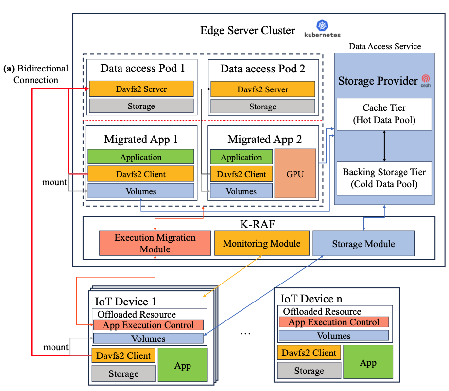

# K-RAF
<!-- 
[ACMHPDC'24] K-RAF: A Kubernetes-based Resource Augmentation Framework for Edge Devices
* [What is TS-trie](#What-is-TS-trie)
* [Settings](#Settings)
    *  [Environments](#Environments)
    *  [Public datasets](#Public-datasets)
* [Building from source](#Building-from-source)
    * [Build TS-trie indexing server](#build-ts-trie-indexing-server)
    * [Build front application server](#Buil-front-application-server)
* [Main Features](#Main-Features)
    * [Point query](#Point-query)
    * [Trajectory query](#trajectory-query)
* [How to Use](#How-to-Use)
    * [Experiment input form](#experiment-input-form)
    * [Experiment process](#experiment-process)
* [Sample Results](#Sample-Results)
    * [Point query](#point-query-1)
    * [Trajectory query](#trajectory-query-1) -->

## What is K-RAF

K-RAF assists edge devices to overcome their limited capabilities by provisioning virtualized computation and storage resources in a Kubernetes environment.

<p align="center">
  </img>
</p>

K-RAF consists of three modules (Execution Migration Module, Monitoring Module, and Storage Module):
1) Execution Migration Module:
    - Utilizes migration features of K-RAF.
    - Receives IoT device's app execution environment info from the database.
    - Performs migration on the edge server by creating application pods on a Kubernetes cluster.
    - User input for GPU usage guides GPU allocation during migration.
    - Kubernetes' Custom Resource Definition partitions GPU VRAM for GPU-reliant applications.

2) Monitoring Module:
    - Consists of Prometheus, Grafana, and Node-exporter.
    - Node-exporter deployed as a pod on each node of the edge server to collect data.
    - Prometheus stores collected data in a database.
    - Grafana visualizes data from Prometheus via a dashboard.
    - Users can query Prometheus to retrieve specific data.

3) Storage Module:
    - Comprises K-RAF's volume-related functions and rook-ceph.
    - rook-ceph builds a storage pool using HDDs and SSDs in the edge server cluster.
    - SSDs classified as cache and HDDs as backing storage for cache-tiering.
    - Kubernetes creates a PV using storage from the pool.
    - K-RAF uses WebDAV Server pods to mount PV to IoT devices for virtual storage.


## Settings

### Environments


**Kubernetes-based Resource Augmentation Framework**
- [Kubernetes v1.22.9]
- [Docker v20.10.16]
- [rook-ceph v1.9.10]
- [davfs2 v1.6.1]

**Edge Server Cluster**
- [Intel i7-11700]
- [RAM 64 GB]
- [SSD 500 GB]
- [HDD 1 TB]
- [Ubuntu 19.04]

**Edge Device**
- [Raspberry Pi 4]
    - Installed davfs2 as WebDAV client

## Building from source

### Build TS-trie indexing server

 Before initiating the compilation process, you need to choose the desired dataset and index format in the location marked with *** in `config.txt` located at `index/TS-trie/`.

    DB_name = SIDE-***
    Index_name = ***

You can use __T-Drive__, __Chicago__, __NYC-yellow__, or __Porto__ for the DB_name,

And for the Index_name, choose __TSC-index__ for the point query or __TSC-index_traj__ for the trajectory query.

For example, if you want to check the Chicago dataset with point query, modify the config file as follows.

    DB_name = SIDE-Chicago
    Index_name = TSC-index


Move to `SIDE/CODE/index` and then compile the code below.

```
sudo g++ --std=c++14 BinaryTrie.h iot_time.h iot_time.cpp cover.h cover.cpp iot_func.h iot_func.cpp ConfigParser.h ConfigParser.cpp main.cpp -o Index $(pkg-config --cflags --libs libmongocxx) -ls2 -lboost_system -lcrypto -lssl -lcpprest -O2 -Wall -lm -m64 -lpthread
```

After compiling, execute the generated `Index` file. This will start the server.

    ./Index


### Build front application server

Open a new terminal and move to the ST-Trie or TS-Trie directory under `SIDE/CODE/index`.

Then compile the code below. 

    python3 app.py

Now you can access the experimental web page.


## Main Features

### Point query
 * #### Spatiotemporal range query

     - Find all spatiotemporal points satisfying the given spatiotemporal conditions.

 * #### k-NN query

     - Retrieve __k__ points in order of proximity from the given x, y coordinates while satisfying the spatiotemporal conditions

 * #### Top-k query

     - Retrieve __k__ points satisfying the given spatiotemporal conditions, selected from an arbitrary ordering criteria.
     - In our experiments, we sorted in descending order based on latitude.


### Trajectory query
 * ####  Spatiotemporal range query

     - Find all trajectories to which points satisfying the given spatiotemporal conditions.

 * ####  k-Similarity query

     - Identify a set of __k__ trajectories within a database that are most similar to a specific trajectory data


## How to Use

### Experiment input form
 - a time range with __two dates__, represented in the ISO 8601 standard format as `YYYY-MM-DD:hh:mm`
 - a rectangular spatial range with __two spatial points__ for spatialtemporal range query, indicating coordinates in terms of __latitude__ and __longitude__.

    example:
    ```
    2013-07-01:09:00:00 ~ 2013-07-01:21:00:00

    (41.15255, -8.650274), (41.161985, -8.638086) #(latitude, longitude), (latitude, longitude)
    ```
 - a circular spatial range with __one spatial point__ for kNN, top-k query.

    example:
    ```
    2013-07-01:09:00:00 ~ 2013-07-01:21:00:00

    (41.15255, -8.650274), 1000 #(latitude, longitude), radius
    ```

### Experiment process

1. Access the web page through  `server_IP:8080`.

2. Place the cursor over the query format applied during compilation (__point__ or __trajectory__) at the top right corner of the webpage, and then choose a specific [query method.](#Main-features)

3. Choose the start and end dates under the time condition.

4. Click on the rectangle shape on the map, then drag to set the spatial range as desired.

    If you've incorrectly set the rectangle, select the trash can icon, click on the rectangles you want to delete, and press the save button next to the icon to remove them.

    > **Warning**
    > If you drag too much on the map, it could an occur error on the server.


5. Press the "Get Coordinate range" button to confirm the input of coordinates
    


6. Press the search button to review the query results.


## Sample Results
### Point query
 * #### Spatiotemporal range query


 * #### k-NN query


 * #### Top-k query


### Trajectory query
 * ####  Spatiotemporal range query


 * ####  k-Similarity query

