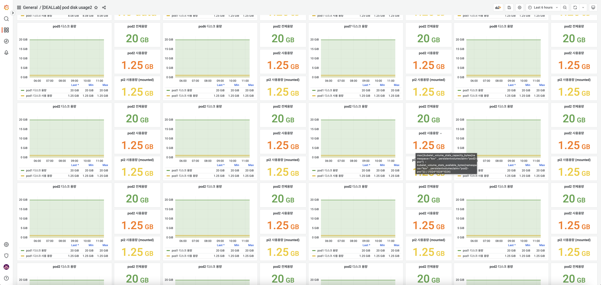

# Install helm , helm chart 
* I ran it on ubuntu 20.04 environment.
* You must have kubernetes installed.
* Everything is done in the ksv namespace.

## 1.helm install
Install on linux ubuntu 20.04 environment.
After downloading the file, execute the script with the command below.
```
curl -fsSL -o get_helm.sh https://raw.githubusercontent.com/helm/helm/main/scripts/get-helm-3
chmod 700 get_helm.sh
./get_helm.sh
```

You can check the installation status and version with the command below.
```
root@master:~helm version
version.BuildInfo{Version:"v3.9.2", GitCommit:"1addefbfe665c350f4daf868a9adc5600cc064fd", GitTreeState:"clean", GoVersion:"go1.17.12"}
```

## Using 2.helm
### Basic usage of 2.1.helm
#### 2.1.1.helm repo add
To use a pre-deployed repository with chart in helm, you need to add a repo. 
You can download the repository with the repo add command. 
```
helm repo add [NAME] [URL] [flags]
```
#### 2.1.2.helm repo list
You can check the list of running charts with the list command below, where you need to check and enter the namespace.
```
root@master:~helm list -A
name namespace revision updated status chart app version
jsonexporter ksv 6 2022-11-01 23:06:29.259408297 +0900 KST deployed prometheus-json-exporter-0.4.0 v0.5.0
prometheus ksv 4 2022-10-31 20:19:34.776034436 +0900 KST deployed kube-prometheus-stack-39.11.0 0.58.0
pvc-autoresizer ksv 1 2022-10-24 16:11:48.440464113 +0900 KST deployed pvc-autoresizer-0.5.0 0.5.0     
```

#### 2.1.3.helm pull
You can install the programme via helm install, but in order to modify the detailed settings (values.yaml or templates inside the templates directory) you need to download the chart first.
```
helm pull [chart URL | repo/chartname] [...] [flags]
```

#### 2.1.4.helm install
Install the chart.
```
helm install [NAME] [CHART] [flags]
```
### 2.2.Installing related programmes
#### 2.2.1.Using Prometheus
We will use kube-prometheus-stack to install prometheus, prometheus-operator, grafana, node-exporter, and related programs in batch. 

Download the kube-prometheus-stack file.
```
helm repo add prometheus-community https://prometheus-community.github.io/helm-charts
helm repo update
helm list -A
helm pull prometheus-community/kube-prometheus-stack
tar -xzf kube-prometheus-stack-55.5.0.tgz
cd kube-prometheus-stack
```

To use the nodeSelector (as well as the nodeAffinity and nodeAntiaffinity functions), you need to set the label per node.

Check node-wide labels
```
kubectl get nodes --show-label
```

Add a label to a node
```
kubectl label nodes {node name} {label key}={label value}
```

Remove a label from a node
```
kubectl label nodes {node name} {label key}-{label value}
```
Modify the values.yaml file to take advantage of the nodeSelector feature.
Search for nodeSelector in values.yaml in the kube-prometheus-stack directory.
Add the pair {label key}-{label value} pairs.

The kube-prometheus-stack/charts directory contains the dependent chart-related files.
Add the nodeSelector also in the values.yaml under grafana/, kube-state-metrics/, prometheus-node-exporter/, prometheus-windows-exporter/.

In the kube-prometheus-stack/ path, add a nodeSelector with
```
helm install prometheus . -n ksv
```
to install the programme.


#### 2.2.2.Json-exporter Using the json-exporter
The json-exporter is included inside the repo in prometheus-community above. 
Import the file via pull.

```

helm pull prometheus-community/prometheus-json-exporter
tar -xzf prometheus-json-exporter-0.9.0.tgz
```

Similarly, add a nodeSelector to the values.yaml in prometheus-json-exporter/.
In the prometheus-json-exporter/ path, add the nodeSelector to the
```
helm install json-exporter . -n ksv
```
to install the programme.

Using an API server to use with Json-exporter (on a real device)
- For users
- Requires python version 3.8 or higher.


#### 2.2.3.Using Pvc-autoresizer 
You need to add a separate repository for pvc-autoresizer. 
```
helm repo add pvc-autoresizer https://topolvm.github.io/pvc-autoresizer
helm repo update
helm pull pvc-autoresizer/pvc-autoresizer
tar -xzf pvc-autoresizer-0.10.1.tgz
```
Add nodeSelector to pvc-autoresizer/values.yaml and pvc-autoresizer/charts/cert-manager/values.yaml.

In the pvc-autoreizer/ path, replace 
```
helm install json-exporter . -n ksv
```
to install it.

#### 2.2.4.Connect to Grafana & apply dashboards
Before connecting to Grafana, you need to check the type of the Grafana service. 
If the type is NodePort, you can access it with the exposed port, but if it is ClusterIP, you need to change it to NodePort. 
```
root@master:~kubectl get service -n ksv
...
prometheus-grafana NodePort 10.101.233.184 <none> 80:32240/TCP 25d
prometheus-kube-prometheus-alertmanager ClusterIP 10.96.31.174 <none> 9093/TCP 25d
prometheus-kube-prometheus-operator ClusterIP 10.108.93.187 <none> 443/TCP 25d
...
```

You can change the type in the values.yaml file of the helm chart and execute the command below to change the type. 
```
kubectl patch svc prometheus-grafana -n ksv -p '{"spec": {"type": "NodePort"}}'
```

If you enter the initial login information, admin/prom-operator, you will see the screen below. 
   
 
  
Click the Dashboards button in the top left corner and click the import button at the bottom. 


The import screen will appear, click the upload JSON file button, open the [DEALLAB] pod disk usage.json file and apply it to see the dashboard. You can modify the metrics and design at this time.

 
 

[Note](https://ksr930.tistory.com/315): Fix helm values.yaml
[Note](https://ksr930.tistory.com/298): install helm