# RPM 서비스 설치
RPM 서비스를 이용하기 위해서는 Go 1.18 버전 및 Node.js 14.18 버전 이상이 필요합니다.
서비스는 Go 1.18 버전 및 Node.js 18.17.1 버전을 이용하여 작성되었습니다.

## 1.사전 준비

### 1.1.Go 설치 및 버전 확인
- apt를 통해 Go를 설치하면 1.13 이상의 버전을 설치할 수 없습니다.
- Go 설치 환경은 다양할 수 있기 때문에, Go 바이너리 파일이 /usr/local/ 아래 설치되었다고 가정하겠습니다.

#### 1.1.1.기존 Go 삭제
```
sudo rm -rf /usr/local/go
```

#### 1.1.2.Go 다운로드
wget을 설치합니다.
```
sudo apt-get install wget
```

- Go 홈페이지에서 Go를 다운로드합니다.
- 홈페이지에서 마우스 우클릭을 통해 설치하고자하는 버전의 링크를 복사합니다.

https://go.dev/dl/

```
wget {복사한 링크}
```

#### 1.1.3.Go 설치
다운로드한 tar 파일 압축을 해제합니다.
```
sudo tar -C /usr/local -xzf go1.XX.X.linux-amd64.tar.gz
```
~/.profile에 다음과 같이 PATH를 추가하고 적용합니다.
```
export PATH=$PATH:/usr/local/go/bin
source ~/.profile
go version # 정상적으로 설치 되었는지 확인
```

### 1.2.Node.js 설치 및 버전 확인

#### 1.2.1.Node.js, npm 기존 버전 삭제
- nvm을 이용해 node.js를 설치합니다.
- 기존에 apt로 node.js, npm을 설치했다면 제거 후 시작합니다.
```
sudo apt-get remove nodejs
sudo apt-get remove npm
```

#### 1.2.2.nvm 설치
```
curl -o- https://raw.githubusercontent.com/nvm-sh/nvm/v0.39.7/install.sh | bash
source ~/.bashrc
nvm -v # 설치되었는지 확인
```

## 1.2.3.Node.js lts 버전 설치
```
nvm install --lts
nvm run default --version
nvm alias default lts/*

node -v
npm -v # 설치되었는지 확인
```

### 1.3.방화벽 설정(포트 열기)
- 방화벽 설정에서 백엔드 서버와 프론트엔드 서버 포트를 허용합니다.
- 기본 포트는 프론트엔드(5173, 4140), 백엔드(31200)으로 설정되어 있습니다.
```
iptables -I INPUT -p tcp --dport {백엔드 서버 포트} -j ACCEPT
iptables -I INPUT -p tcp --dport {프론트엔드 서버 포트} -j ACCEPT
```

## 2. RPM 서비스(볼륨 서비스) 설치

### 2.1.git clone
git clone으로 리포지토리를 복사해옵니다.
```
git clone https://github.com/lab-paper-code/ksv.git
```

### 2.2.프론트엔드 설정
- volume-service/FE 디렉토리에 프론트엔드 설정을 위한 스크립트 파일이 있습니다.
    - set_admin_page.sh, set_user_page.sh
    - 각각 admin, user 설정 파일을 생성합니다.

### 2.3.IP주소 수정
- 사용 환경에 맞게 IP주소를 수정합니다.
1. RPM
- 1) volume-service/rest/adapter.go
35번째 줄의 AllowOrigins 리스트(슬라이스)에 프론트엔드 서버 IP주소를 입력합니다.
```
AllowOrigins: []string{"{프론트엔드 서버 IP}"},
```
예를 들어,
```
AllowOrigins: []string{"155.230.96.111:5173"},
```
과 같이 설정합니다.

- 2) volume-service/rest/volume-handlers.go
17, 18번째 줄의 prometheusServiceIP, prometheusPort를 설정합니다.
```
prometheusServiceIP       = "{프로메테우스 서비스 IP}"
prometheusPort            = "{포트 번호}"
```
예를 들어,
```
prometheusServiceIP       = "155.230.96.111"
prometheusPort            = "31152"
```
와 같이 설정합니다.

2. 프론트엔드
- 1) volume-service/web/FE/admin/src/lib/request.js
3번째 줄의 _url을 백엔드 서버에 맞게 수정합니다.
```
let _url = '{프론트엔드 서버 IP주소}' + url;
```
예를 들어,
```
let _url = '155.230.96.111:31200' + url;
```
와 같이 설정합니다.

- 2) volume-service/web/FE/admin/package.json
7번째 줄의 "vite" 명령어에 flag를 추가해줍니다.
```
"dev": "vite --host {호스트 주소} --port {포트}",
```
예를 들어,
```
"dev": "vite --host 155.230.96.111 --port 5174",
```
와 같이 설정합니다. 포트는 기본값이 5173이므로, 다른 포트를 사용하는 경우에만 추가해주면 됩니다.

- 3) volume-service/web/FE/user/src/lib/request.js
3번째 줄의 _url을 백엔드 서버에 맞게 수정합니다.
```
let _url = '{프론트엔드 서버 IP주소}' + url;
```

- 4) volume-service/web/FE/user/package.json
7번째 줄의 "vite" 명령어에 flag를 추가해줍니다.
```
"dev": "vite --host {호스트 주소} --port {포트}",
```

### 2.4.RPM 설정
- volume-service/ 디렉토리에 실행파일을 만들기 위한 Makefile이 있습니다.
- Makefile을 실행하면 환경변수를 자동으로 설정하고 volume-service/bin/ 폴더 아래에 실행 파일(volume-service)을 생성합니다.
```
make
```

### 2.5.서비스 실행
프론트엔드 서버 실행
volume-service/FE/admin 또는 volume-service/FE/user  경로에서
```
npm run dev
```
로 서버를 실행합니다.

이후

volume-service/ 경로에서
```
./bin/volume-service -c config.yaml
```
로 rpm 서비스를 실행합니다.

## 3.RPM 서비스 설명
RPM 서비스는 크게 4개의 객체(App, AppRun, Device, Volume)에 관한 기능으로 구성되어 있습니다.

### 3.1.App 관련 기능
#### 3.1.1. App
1. Register App(admin)
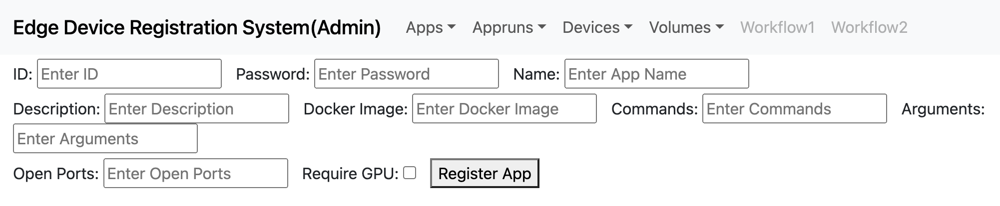
RPM에서 이용할 애플리케이션을 등록합니다.

id, password
: admin 권한을 확인합니다.

Name(필수), Description, Docker_image(필수), Commands, Arguments, Open Ports, Require GPU 
: 애플리케이션 관련 정보입니다.
Docker_image는 애플리케이션 파드 생성 시 이용할 도커 이미지를 입력합니다.
Commands, Arguments는 파드 실행 시 실행할 명령과 인자를 입력합니다.
해당 입력이 없을 경우, 도커 이미지에 정의된 명령을 실행합니다.
Open Ports는 애플리케이션 사용을 위해 외부로 노출할 포트 번호입니다.
Require GPU는 GPU 사용 여부를 확인합니다.

2. Search App(user, admin)
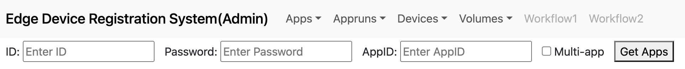
RPM DB에 등록된 App을 검색합니다.
Multi-app을 체크할 경우 등록된 전체 App 목록을 반환합니다.
Multi-app을 체크해제하고, AppID를 입력하면, 특정 App 정보만 반환합니다.


#### 3.1.2.AppRun
1. Execute AppRun(user, admin)
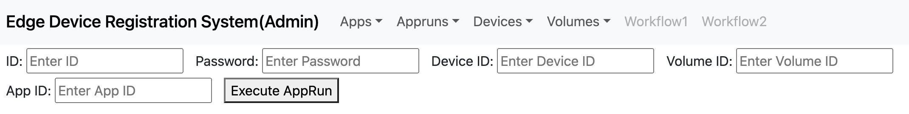
DeviceID, VolumeID, AppID를 입력받아 애플리케이션 파드를 생성합니다.
애플리케이션 파드를 실행하기 위한 리소스(Deployment, Service, Ingress)를 같이 생성합니다.
VolumeID에 해당되는 PV가 애플리케이션 파드에 마운트되어 애플리케이션 실행 시 스토리지로 이용할 수 있습니다.

2. Search AppRun(user, admin)
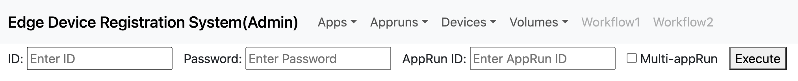
RPM DB에 등록된 AppRun을 검색합니다.
Multi-appRun을 체크할 경우 등록된 전체 AppRun 정보를 반환합니다.
Multi-appRun을 체크해제하고, AppRunID를 입력할 경우 특정 AppRun 정보만 반환합니다.

3. Terminate AppRun(user, admin)

AppRunID를 입력 받아 애플리케이션 파드 리소스를 제거합니다.

#### 3.1.3.Device 
1. Register Device(admin)
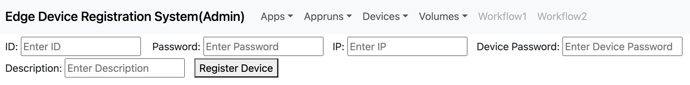
RPM에 실디바이스를 등록합니다.
id, password
: admin 권한을 확인합니다.

IP, Device Password(필수), Description
IP: 실디바이스의 IP를 입력합니다. 데이터를 입력하지 않을 경우, 요청을 보낸 경로의 IP를 자동으로 입력합니다.

Device Password : RPM 기능을 사용하기 위한 Password입니다. 디바이스 등록 후 생성되는 DeviceID와 함께 사용하여 실디바이스를 확인합니다.

2. Search Device(admin)
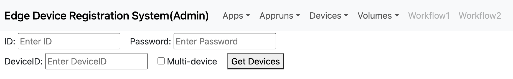
RPM DB에 등록된 Device를 검색합니다.
Multi-Device를 체크할 경우 등록된 전체 Device 정보를 반환합니다.
Multi-Device를 체크해제하고 DeviceID를 입력할 경우 특정 Device 정보만 반환합니다.

3. Update Device(user)
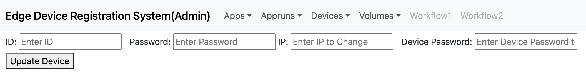
RPM DB에 등록된 Device 정보를 수정합니다.
IP 또는 Device Password를 수정합니다.

#### 3.1.4.Volume
1. Create Volume(admin, user)
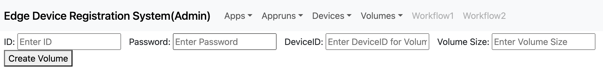
RPM에서 볼륨(PVC)를 생성합니다.
DeviceID: RPM에서는 디바이스 단위로 볼륨을 관리하므로, Device ID를 입력해야 합니다.
Volume Size: 문자열(ex.10gb)로 입력을 받습니다.
kb, mb, gb, tb 까지 입력을 지원하며, 제공하는 최소 볼륨 크기는 1GB 입니다.

2. Search Volume(admin, user)
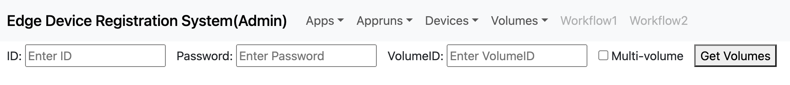
RPM DB에 등록된 Volume을 검색합니다.
Multi-Volume을 체크할 경우 등록된 전체 Volume 정보를 반환합니다.
Multi-Volume을 체크해제하고, 특정 VolumeID를 입력할 경우. 특정 Volume 정보만 반환합니다.

3. Update Volume(admin, user)

RPM DB에 등록된 Volume 정보를 수정합니다.
볼륨 크기를 수정합니다.

4. Delete Volume(admin, user)
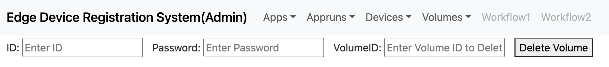
볼륨을 삭제합니다.
볼륨이 마운트 되어 있다면 삭제하지 않고, 마운트 되어 있지 않다면 삭제합니다.

5. Mount Volume(user)
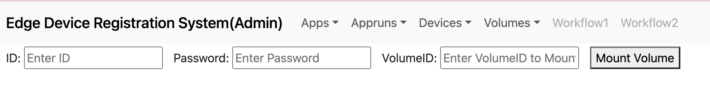
실디바이스에 볼륨을 마운트하기 위한 WebDAV 파드를 생성합니다.
WebDAV 파드를 생성하기 위한 리소스(Deployment, Service, Ingress)를 같이 생성합니다.
WebDAV 파드를 실디바이스의 디렉토리에 마운트할 경우, PV를 가상 스토리지로 이용할 수 있습니다.
(rpm_data_share.md 파일에 예시를 설명하였습니다.)

6. Unmount Volume(user, admin)
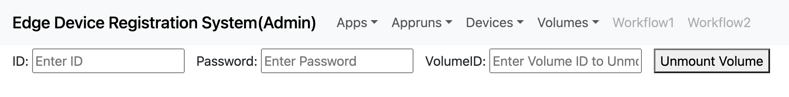
VolumeID를 입력받아 WebDAV 파드 리소스를 제거합니다.

[참고](https://stdhsw.tistory.com/entry/golang-version-upgrade-ubuntu): Go 설치
[참고](https://iter.kr/%EC%9A%B0%EB%B6%84%ED%88%AC-nvm-node-js-%EC%84%A4%EC%B9%98-%EC%84%A4%EC%A0%95/): nvm으로 node.js 설치
[참고](https://archijude.tistory.com/392): 방화벽 설정