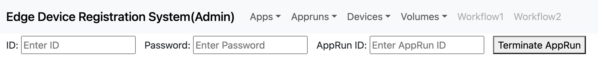

# RPM Service Installation
The RPM service requires Go version 1.18 and Node.js version 14.18 or later.
The service was written using Go version 1.18 and Node.js version 18.17.1.

## 1. Preparing in advance

### 1.1. Go Installation (Verifying the version)
- If you install Go via apt, you will not be able to install versions higher than 1.13.
- Since Go installations can vary, we'll assume that the Go binary files are installed under /usr/local/.

#### 1.1.1. Delete an existing Go
```
sudo rm -rf /usr/local/go
```

#### 1.1.2.Go Download
Install wget.
```
sudo apt-get install wget
```
- Download Go from the Go homepage.
- From the homepage, copy the link to the version you want to install via right-click.

https://go.dev/dl/

```
wget {copied link}
```

#### 1.1.3. Go Installation
Unzip the downloaded tar file.
```
sudo tar -C /usr/local -xzf go1.XX.X.linux-amd64.tar.gz
```
Add the PATH to ~/.profile and apply it as follows
```
export PATH=$PATH:/usr/local/go/bin
source ~/.profile
go version # Verify that it is installed correctly
```

### 1.2.2. Node.js install and check version
#### 1.2.1. Node.js, npm delete existing version
- Install node.js using nvm.
- If you previously installed node.js, npm with apt, uninstall and start.
```
sudo apt-get remove nodejs
sudo apt-get remove npm
```


#### 1.2.2. nvm Insatllation
```
curl -o- https://raw.githubusercontent.com/nvm-sh/nvm/v0.39.7/install.sh | bash
source ~/.bashrc
nvm -v # verify nvm is installed
```

## 1.2.3. nstalling the lts version of Node.js
```
nvm install --lts
nvm run default --version
nvm alias default lts/*

node -v
npm -v # verify Node.js lts is installed
```

### 1.3.Firewall settings (open ports)
- In the firewall settings, allow the backend server and frontend server ports.
- The default ports are set to frontend (5173, 4140) and backend (31200).
```
iptables -I INPUT -p tcp --dport {backend server port} -j ACCEPT
iptables -I INPUT -p tcp --dport {frontend server port} -j ACCEPT
```

## 2. Install the RPM service (Volume Service)
### 2.1.git clone
Copy the repository with git clone.
```
git clone https://github.com/lab-paper-code/ksv.git
```

### 2.2.Front-end configuration
- The volume-service/FE directory contains script files for front-end configuration.
    - set_admin_page.sh, set_user_page.sh
    - Create the admin and user configuration files, respectively.

### 2.3.Modify the IP address
- Modify the IP address to suit your environment.
1. RPM
- 1) volume-service/rest/adapter.go
Enter the frontend server IP address in the AllowOrigins list (slice) on line 35.
```
AllowOrigins: []string{"{Frontend server IP}"},
```
For example,
```
AllowOrigins: []string{"155.230.96.111:5173"},
```

- 2) volume-service/rest/volume-handlers.go
Set the prometheusServiceIP, prometheusPort on lines 17 and 18.
For example,
```
prometheusServiceIP = "{Prometheus Service IP}"
prometheusPort = "{Port number}"
```
For example,
```
prometheusServiceIP = "155.230.96.111"
prometheusPort = "31152"
```


2. Front-End
- 1) volume-service/web/FE/admin/src/lib/request.js
Modify the _url in line 3 to match your backend server.
```
let _url = '{frontend server IP address}' + url;
```
For example,
```
let _url = '155.230.96.111:31200' + url;
```

- 2) volume-service/web/FE/admin/package.json
Add the flag to the "vite" command on line 7.
```
"dev": "vite --host {host address} --port {port}",
```
For example,
```
"dev": "vite --host 155.230.96.111 --port 5174",
```
The port defaults to 5173, so you only need to add it if you use a different port.

- 3) volume-service/web/FE/user/src/lib/request.js
Modify the _url in line 3 to match your backend server.
```
let _url = '{frontend server IP address}' + url;
```

- 4) volume-service/web/FE/user/package.json
Add a flag to the "vite" command on line 7.
```
"dev": "vite --host {host address} --port {port}",
```

### Setting up 2.4.RPM
- In the volume-service/ directory, there is a Makefile for creating an executable.
- When you run the Makefile, it will automatically set the environment variables and create an executable (volume-service) under the volume-service/bin/ folder.
```
make
```

### 2.5.Run the service
Run the front-end server
In the volume-service/FE/admin or volume-service/FE/user path, run the
```
npm run dev
```
to run the server.

Then,

in the volume-service/ path
```
./bin/volume-service -c config.yaml
Run the rpm service with 
```
to run the RPM service.

## 3.RPM Service Description
The RPM service consists of functions for four main objects: App, AppRun, Device, and Volume.

### 3.1.App Related Features
#### 3.1.1. App
1. Register App(admin)

Registers an application to be used in the RPM.

id, password
: Checks for admin privileges.

Name (required), Description, Docker_image (required), Commands, Arguments, Open Ports, Require GPU 
: Application-specific information.
Docker_image is the docker image to use when creating the application Pod.
Commands, Arguments provides commands and arguments to run when running the Pod.
If no such input is provided, it runs the commands defined in the docker image.
Open Ports is the port number to expose externally for application use.
Require GPU checks to see if a GPU is enabled.

2. Search App(user, admin)

Searches for apps registered in the RPM DB.
If Multi-app is checked, it returns a list of all registered apps.
If Multi-app is unchecked and AppID is entered, only specific app information is returned.


#### 3.1.2.AppRun
1. Execute AppRun(user, admin)

Create an application pod with DeviceID, VolumeID, and AppID.
Create the resources (Deployment, Service, Ingress) to run the application pod together.
The PV corresponding to the VolumeID is mounted in the application Pod and is available for storage when the application runs.

2. Search AppRun(user, admin)

Searches for AppRuns registered in the RPM DB.
If Multi-appRun is checked, it returns all registered AppRun information.
If Multi-appRun is unchecked and AppRunID is entered, only specific AppRun information is returned.

3. Terminate AppRun(user, admin)

Takes an AppRunID and removes the application Pod resource.

#### 3.1.3.Device 

1. Register Device(admin)

Register a physical device with the RPM.
id, password
: Confirm the admin permission.

IP, Device Password (required), Description
IP: Enter the IP of the silent device. If no data is entered, the IP of the path from which the request was sent is automatically entered.

Device Password: Password to use the RPM feature. Use it with the DeviceID generated after device registration to identify the real device.

2. Search Device(admin)

Searches for devices registered in the RPM DB.
If Multi-Device is checked, it returns all registered device information.
If Multi-Device is unchecked and DeviceID is entered, only specific device information is returned.

3. Update Device(user)

Modifies the device information registered in the RPM DB.
Modify IP or Device Password.

 
#### 3.1.4.Volume
1. Create Volume(admin, user)

Create a volume (PVC) in RPM.
DeviceID: RPM manages volumes on a per-device basis, so you must enter the device ID.
Volume Size: Accepts input as a string (ex.10gb).
It supports input up to kb, mb, gb, tb, and the minimum volume size it provides is 1GB.

2. Search Volume(admin, user)

Search for a volume registered in the RPM DB.
If Multi-Volume is checked, it returns all registered volume information.
If Multi-Volume is unchecked and a specific VolumeID is entered, only the specific Volume information is returned.

3. Update Volume(admin, user)

Modifies the volume information registered in the RPM DB.
Modify the volume size.

4. delete volume(admin, user)

Delete the volume.
If the volume is mounted, it will not be deleted; otherwise, it will be deleted.

5. Mount Volume(user)

Create a WebDAV Pod to mount the volume on the physical device.
Create the resources (Deployment, Service, Ingress) together to create the WebDAV Pod.
When you mount the WebDAV Pod to a directory on the physical device, you can use the PV as virtual storage.
(An example is provided in the rpm_data_share.md file).

6. unmount Volume(user, admin)

Remove a WebDAV Pod resource by taking a VolumeID


[reference](https://stdhsw.tistory.com/entry/golang-version-upgrade-ubuntu): Go Installation

[reference](https://iter.kr/%EC%9A%B0%EB%B6%84%ED%88%AC-nvm-node-js-%EC%84%A4%EC%B9%98-%EC%84%A4%EC%A0%95/): Installing node.js with nvm

[reference](https://archijude.tistory.com/392): Firewall settings