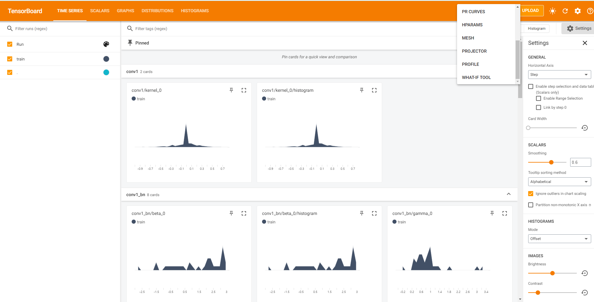
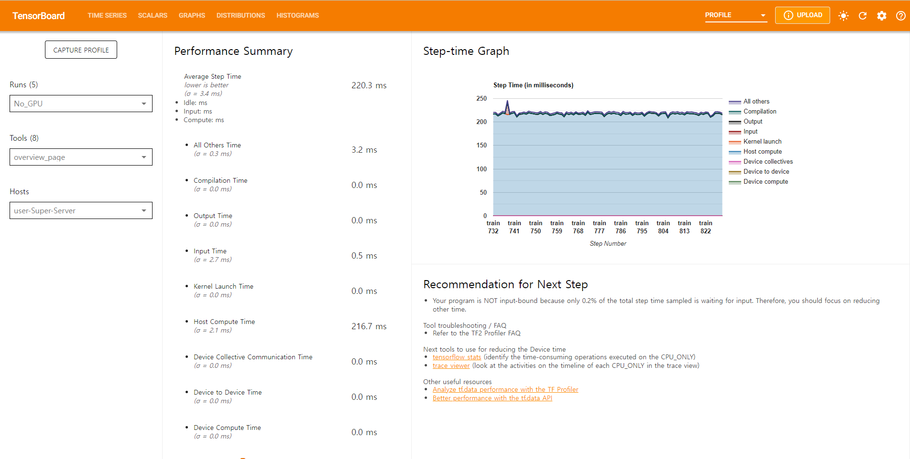

# Analyzing Input Pipeline Stalls of Fine-tuning Workload in TensorFlow
* TensorFlow를 사용한 모델 fine-tuning workload에서, Input pipeline 상에 존재하는 bottleneck을 분석
* ImageNet 모델과 ILSVRC2012 Validation Dataset을 사용

## Prerequisite
* Python 3.X
  * 사용한 파이썬 라이브러리는 requirements.txt에 정리

## Usage
### 1. Dataset 다운로드 및 Python 가상 환경 셋업
`setup.sh` 스크립트를 실행하여 다음의 작업을 수행한다.

```shell
sh setup.sh
```

1. ILSVRC2012 데이터셋 다운로드
2. 다운로드한 데이터셋의 압축을 풀어, 모든 sample을 `images` 폴더로 이동 (총 50,000개의 샘플)
3. 데이터셋 내의 샘플을 카테고리 별로 분류 (총 1,000개의 카테고리)
4. Python 3의 가상 환경 생성 및 `requirements.txt`에 포함된 모듈 설치

### 2. Fine-tuning workload 실행
#### 2-1. JPEG Samples로 학습
`scripts/image_fine-tuning.py` 스크립트를 실행한다.

```shell
python3 scripts/image_fine-tuning.py
```

적용할 수 있는 옵션은 다음과 같다.
* `--dataset_path`: 데이터셋이 존재하는 위치. 디폴트 값은 `images`이다.
* `--dataset_size`: 데이터셋 내의 샘플 개수. 디폴트 값은 `50000`이다.
* `--batch_size`: 배치 크기. 디폴트 값은 `32`이다.
* `--epochs`: 에포크 횟수. 디폴트 값은 `1`이다.
* `--log_path`: TensorFlow profiling 결과를 저장할 경로. 디폴트 값은 없으며, **설정하지 않은 경우 프로파일링을 수행하지 않는다.**
* `--checkpoint_path`: 학습 도중 체크포인트를 저장할 경로. 디폴트 값은 없으며, **설정하지 않은 경우 체크포인트를 저장하지 않는다.**
* `--base_model`: Fine-tuning할 pre-trained model. 디폴트 값은 없음.

옵션 적용 예시:
```shell
python3 scripts/image_fine-tuning.py --epochs=5 --base_model=imagenet
```

#### 2-2. TFRecords로 학습
`scripts/tfrecord_converter.py` 스크립트를 사용하면, 여러 샘플을 특정 크기의 TFRecords로 변환하여 저장할 수 있다.

```shell
python3 scripts/tfrecord-converter.py
```

적용할 수 있는 옵션은 다음과 같다.
* `--dataset_path`: 데이터셋이 존재하는 위치. 디폴트 값은 `images`이다.
* `--size_per_record`: 한 TFRecords의 크기 (Bytes), 디폴트 값은 52428800 (5MB)이다.
* `--output_path`: TFRecords 파일을 저장할 디렉토리. 디폴트 값은 `tfrecords`이며, 디렉토리가 존재하지 않는 경우에는 생성한다.

변환한 TFRecord 파일로 학습할 때에는 `scripts/tfrecord_fine-tuning.py` 스크립트를 사용한다. 사용 방법은 `scripts/image_fine-tuning.py`과 같다.

## 3. Profiling Result 확인
**스크립트 실행 시 `--log_path`를 설정했을 때에만 확인 가능**  

`tensorboard`를 실행한다. (아래는 `--log_path=profiles`일  때의 예시)
```shell
tensorboard --logdir=profiles
```

터미널에 출력된 주소로 이동한다.



우측 상단 메뉴 중 `PROFILE`을 선택한다.



위와 같이 `logdir`에 저장된 프로파일링 결과를 확인할 수 있다.

