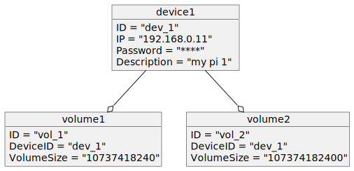

# K-RAF

Run the service 

```bash
./bin/volume-service -c config.yaml
```

## Object Diagram
<!--
@startuml object
object device1 {
    ID = "dev_1"
    IP = "192.168.0.11"
    Password = "****"
    Description = "my pi 1"
}

object volume1 {
    ID = "vol_1"
	DeviceID = "dev_1"
	VolumeSize = "10737418240"
}

object volume2 {
    ID = "vol_2"
	DeviceID = "dev_1"
	VolumeSize = "107374182400"
}

device1 --o volume1
device1 --o volume2

@enduml
-->

<p align="center">
  </img>
</p>

## How to run a frontend server
We use **Svelte** and **Bootstrap5** for running frontend server.

1. Svelte
	- https://svelte.dev/
2. Bootstrap
	- https://getbootstrap.com/

Both frameworks require Node.js, so make sure Node.js is installed in your system before you do the following:

1. Make virtual environment(ex. venv, pyenv, ...) and run :
`npm create vite@latest <virtual env name> -- --template svelte` 

This creates a folder of the identical name inside the virtual environment where vite(template: Svelte) is installed. Then, copy package.json and package-lock.json and `run npm install`. It will install all the dependencies inside the folder. Then substitute files inside the src folder with the files in FE/admin (admin) or FE/user (user).

2. Then `npm run dev` to run the frontend server.
